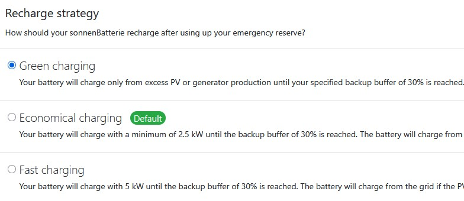

# SonnenBackup

Read from the real-time API on Sonnen Batterie to manage Backup Reserve use.

Use Sonnen Batterie web portal or mobile app to set Backup Reserve percent.

* System state On Grid, Off Grid or Critical Error.
* Real time power, current and voltage.
* Battery levels, Charge/Discharge rate, time to fully charged.
* Backup reserve, time to reserve, time to fully discharge.
* MicroGrid status when Offgrid & Blackstart settings.
* Temperature and batterie health.

## Why use this package
This Home Assistant component helps manage Sonnen batterie backup reserve, particularly whilst batterie is 'OffGrid'.

The official Sonnen mobile app normally used to monitor the batterie relies on the cloud service the batterie reports to. When grid power is off, it is likely Internet may also be out either due to the same event or eventually power is out long enough to deplete ISP equipment emergency power.

Without Internet access, Home Assistant server requires only the local home network to continue functioning using the Sonnen batterie backup reserve charge.

It is recommended to have an independent (small) UPS running off Sonnen batterie power for the LAN & Home Assistant server. There is a momentary power drop when Sonnen batterie switches to MicroGrid mode when grid power drops. A small UPS will prevent Home Assistant server from rebooting at the very moment it needs to alert you to batterie *system_status* changed to "OffGrid".

The excellent Weltmeyer/ha_sonnenbatterie package uses API v1 with user/password authentication. If you can't use a user account with API v1, this API v2 package can also be used to configure HASS Energy dashboard.

## HACS

Install SonnenBackup integration.

Uses sonnen_api_v2 driver package which requires a readonly API Token created in the Sonnen Batterie management portal.

Configuration will require the IP address of the battery device and the readonly API token.  \
If the Batterie portal uses a non-standard port, other than 80, that can be configured too.  \
The API package does not support https (port 443) using a self-signed certificate.

## Usage

Install sonnenbackup with hacs.  \
[](https://my.home-assistant.io/redirect/hacs_repository/?owner=MarkusBiggus&repository=https%3A%2F%2Fgithub.com%2FMarkusBiggus%2FSonnenBackup&category=integration)

### Manual Integration to HACS

Open HACS -> Home Assistant Community Store page  \
From Overflow Menu: 3 vertical dots upper right, choose custom repositories.  \
Enter github URL: https://github.com/MarkusBiggus/SonnenBackup  \
The component is added to HACS and the form redisplayed - click cancel to return to HACS.

Search HACS for the component just added, SonnenBackup.  \
Click the Integration to see its details page.  \
On the component details page click the download button lower right.  \
Return to HACS (upper left arrow) where "Pending Restart" is displayed.

Restart HASS from Settings/System restart button, upper far right.

### Add Integration

From Settings/Devices & Services, click Add Integration button, lower right.


## Sensors

HASS Sensor is the name used by Home Assistant from the sonnen_api_v2 package property.

| HASS Sensor        | Package Property              | Type  | When Valid        |
|:-------------------|------------------------------:|:-----:|:-----------------:|
|activity_state|battery_activity_state|string|always|
|blackstart_time1|configuration_blackstart_time1|string|when configured|
|blackstart_time2|configuration_blackstart_time2|string|when configured|
|blackstart_time3|configuration_blackstart_time3|string|when configured|
|firmware_version|configuration_de_software|string|always|
|interval_since_full|time_since_full|string|always|
|interval_to_fully_charged|time_to_fully_charged|string|charging is true|
|interval_to_fully_discharged|time_to_fully_discharged|string|discharging is true|
|interval_to_reserve|time_to_reserve|string|*see notes below*|
|led_state|led_state|string|always|
|led_state_text|led_state_text|string|always|
|operating_mode|configuration_em_operatingmode|string|always|
|state_bms|state_bms|string|always|
|state_inverter|state_inverter|string|always|
|system_status|system_status|string|always|
|cycle_count|battery_cycle_count|integer|always|
|average_current|battery_average_current|Amps|always|
|unusable_capacity|battery_unusable_capacity_wh|Wh|always|
|capacity_to_reserve|capacity_to_reserve|Wh|usable_capacity => reserve_capacity|
|capacity_until_reserve|capacity_until_reserve|Wh|usable_capacity <= reserve_capacity|
|full_charge_capacity|battery_full_charge_capacity_wh|Wh|always|
|remaining_capacity|remaining_capacity_wh|Wh|always|
|reserve_capacity|backup_buffer_capacity_wh|Wh|always|
|usable_capacity|usable_remaining_capacity_wh|Wh|always|
|used_capacity|used_capacity|Wh|always|
|frequency|status_frequency|hertz|always|
|kwh_consumed|kwh_consumed|kWh|always|
|kwh_produced|kwh_produced|kWh|always|
|depth_of_discharge_limit|battery_dod_limit|percent|always|
|relative_charge|battery_rsoc|percent|always|
|usable_charge|battery_usoc|percent|always|
|reserve_charge|status_backup_buffer|percent|always|
|charge_power|charging|watts|charging is true|
|consumption_average|consumption_average |watts|always|
|consumption_now|consumption|watts|always|
|discharge_power|discharging|watts|discharging is true|
|grid_export|status_grid_export|watts|always|
|grid_import|status_grid_import|watts|always|
|offgrid_power|inverter_pac_microgrid|watts|system_status is 'OffGrid'|
|ongrid_power|inverter_pac_total|watts|system_status is 'OnGrid'|
|production_now|production|watts|always|
|max_battery_temp|battery_max_cell_temp|celsius|always|
|min_battery_temp|battery_min_cell_temp|celsius|always|
|fully_charged_at|fully_charged_at|timestamp|charging is true|
|fully_discharged_at|fully_discharged_at|timestamp|discharging is true|
|last_time_full|last_time_full|timestamp|always|
|last_updated|last_updated|timestamp|always|
|reserve_at|backup_reserve_at|timestamp|*see notes below*|
|status_timestamp|system_status_timestamp|timestamp|always|
|time_since_full|time_since_full|deltatime|always|
|time_to_fully_charged|time_to_fully_charged|deltatime|charging is true|
|time_to_fully_discharged|time_to_fully_discharged|deltatime|discharging is true|
|time_to_reserve|time_to_reserve|deltatime|*see notes below*e|
|blackstart_enabled|configuration_em_reenable_microgrid|bool|when configured|
|microgrid_enabled|microgrid_enabled|bool|system_status is 'OffGrid'|
|charging|status_battery_charging|bool|always|
|discharging|status_battery_discharging|bool|always|
|dc_minimum_rsoc|dc_minimum_rsoc_reached|bool|microgrid_enabled is true|
|microgrid_minimum_soc|mg_minimum_soc_reached|bool|microgrid_enabled is true|


Some sensors have enumerated values:

```
system_status: ["Config", "OnGrid", "OffGrid", "Critical Error"]
activity_state: ["standby", "charging", "discharging", "discharging reserve", "charged", "discharged"]
operating_mode: {1: "Manual", 2: "Automatic", 6: "Extension module", 10: "Time of Use"}
```

### Backup Reserve sensors
Sensors *time_to_reserve* & *interval_to_reserve* are the same measurement with different datatypes. HASS has problems with delatime format sensors so a string format with prefix 'interval' is also provided. Use the string format in things like LogBooks and anywhere deltatime values don't work as expected.

```
Calculations to Reserve capacity are only valid when:
  *usable_charge* is above *reserve_charge* whilst *discharging* is true
  *usable_charge* is below *reserve_charge* whilst *charging* is true
in both cases, *time_to_reserve* is estimated using current *charge_power* or *discharge_power* values.
```

### activity_state
"standby" indicates the battery is neither charging nor discharging.
The battery could be fully charged, fully discharged or at backup reserve charge.
Must be read in conjuction with *usable_charge* to determine the reason for "standby".

### Timestamps
Timestamps are datetime.datetime objects.  \
Sensors *fully_charged_at*, *fully_discharged_at* & *backup_reserve_at* are calculated on current *charge_power* or *discharge_power* values.
When battery *activity_state* is 'standby', these timestamp values are undefined.
Times are calculated relative to Sonnen batterie server time *system_status_timestamp*.
A slight discrepency will be apparent if HASS server time and batterie time are different.

### Deltatimes
Deltatimes are datetime.deltatime objects.  \
Sensors prefixed with 'time_to' or 'time_since' are delatime objects.
Sensors prefixed with 'interval' are deltatimes presented as a string format "D HH:MM:SS".
Home assistant doesn't handle deltatimes well, use interval strings for logbook recording.
Sensors with 'seconds_' prefix are the values used to create the deltatime objects.

### led_state
Sensor indicates the state of the status LED on the side of the battery.
Only one element may be True, that element, with brightness, is returned as a string.  \
e.g 'Pulsing White 100%'
```
"Eclipse Led":{
    "Blinking Red":true,   # Error - call installer!
    "Brightness":100,
    "Pulsing Green":true,  # Off Grid.
    "Pulsing Orange":true, # No Internet connection!
    "Pulsing White":true,  # Normal Operation.
    "Solid Red":true       # Critical Error - call installer!
}
```
All values False indicates Off Grid operation, the string "Off Grid." is returned.

### led_state_text
The meaning of the current LED state as defined in the user manual.  \
Comments in example are text string returned.  \
eg. "Normal Operation." is returned for LED state 'Pulsing White 100%'

### State of Charge
Sonnen batterie reports two State of Charge values, Relative and Usable. The difference between these two values is reported by sensor *depth_of_discharge_limit* (DoD). Depth of Discharge reserve is included in *relative_charge* (RSoC) overall values, like *full_charge_capacity*.
Specific usable values are based on *usable_charge* (USoC), like *usable_capacity*, which do not include the DoD limit reported by sensor *unusable_capacity*.

Importantly, the *reserve_charge* percent for backup buffer is based on USoC. eg. when sensor *activity_state* is 'standby' USoC equals Backup Reserve Charge, a little less than RSoC.

Sensors *capacity_to_reserve* & *capacity_until_reserve* are both zero when battery is in standby at *reserve_capacity*. Otherwise, only one has a value depending on USoC being above or below *reserve_charge*.

## Recording
Some sensor values do not change, some only change when configuration changes, some are of little value when not current. These sensors will waste space if recorded.

Suggested recording exclusions in configuration.yaml:
```
# Recorder filter to exclude specified entities, change placeholder names
# your actual sensor names.
# eg. "sonnenbackup_nnnnnn_full_charge_capacity"
#   where 'nnnnnn' is the battery serial number entered on the config form.
recorder:
  exclude:
    entities:
      - sensor.sonnenbackup_nnnnnn_backup_reserve_at
      - sensor.sonnenbackup_nnnnnn_backup_reserve_percent
      - sensor.sonnenbackup_nnnnnn_blackstart_enabled
      - sensor.sonnenbackup_nnnnnn_blackstart_time1
      - sensor.sonnenbackup_nnnnnn_blackstart_time2
      - sensor.sonnenbackup_nnnnnn_blackstart_time3
      - sensor.sonnenbackup_nnnnnn_depth_of_discharge_limit
      - sensor.sonnenbackup_nnnnnn_full_charge_capacity
      - sensor.sonnenbackup_nnnnnn_fully_charged_at
      - sensor.sonnenbackup_nnnnnn_fully_discharged_at
      - sensor.sonnenbackup_nnnnnn_interval_to_fully_charged
      - sensor.sonnenbackup_nnnnnn_interval_to_fully_discharged
      - sensor.sonnenbackup_nnnnnn_interval_to_reserve
      - sensor.sonnenbackup_nnnnnn_interval_since_full
      - sensor.sonnenbackup_nnnnnn_led_state
      - sensor.sonnenbackup_nnnnnn_last_time_full
      - sensor.sonnenbackup_nnnnnn_last_updated
      - sensor.sonnenbackup_nnnnnn_operating_mode
      - sensor.sonnenbackup_nnnnnn_reserve_charge
      - sensor.sonnenbackup_nnnnnn_seconds_since_full
      - sensor.sonnenbackup_nnnnnn_state_bms
      - sensor.sonnenbackup_nnnnnn_state_inverter
      - sensor.sonnenbackup_nnnnnn_status_frequency
      - sensor.sonnenbackup_nnnnnn_system_status_timestamp
      - sensor.sonnenbackup_nnnnnn_time_to_fully_charged
      - sensor.sonnenbackup_nnnnnn_time_to_fully_discharged
      - sensor.sonnenbackup_nnnnnn_time_to_reserve
      - sensor.sonnenbackup_nnnnnn_time_since_full
      - sensor.sonnenbackup_nnnnnn_unusable_capacity
```

# Config Energy Dashboard

## Create Helpers for Energy dashboard
Go to Settings then Devices & Services then select Helpers from the top menu.
Create each of the 6 integrals by clicking “+ CREATE HELPER”, lower right.

Choose  Integral Sensor -> Add Riemann sum integral sensor:
use Left rule for conservative values, Trapezoidal rule for more realistic values over longer periods.

|  Helper Name       |    SonnenBackup Input Sensor                               | Rule |Precision | Interval |
|-------------------:|:-----------------------------------------------------------|:----:|:--------:|:--------:|
| PowerConsumption   | sensor.sonnenbackup_nnnnnn_consumption_now| Trapezoidal | 1 | 10 seconds|
| PowerProduction| sensor.sonnenbackup_nnnnnn_production_now| Trapezoidal | 1 | 10 seconds|
| GridImport| sensor.sonnenbackup_nnnnnn_grid_import| Trapezoidal | 1 | 10 seconds|
| GridExport| sensor.sonnenbackup_nnnnnn_grid_export| Trapezoidal | 1 | 10 seconds|
| BatteryInput| sensor.sonnenbackup_nnnnnn_charging| Trapezoidal | 1 | 10 seconds|
| BatteryOutput| sensor.sonnenbackup_nnnnnn_discharging| Trapezoidal | 1 | 10 seconds|


XXXXX will be the Batterie serial number entered on the configuration form.  \
Metric prefix is blank, all package sensor integer values are single units.  \
Use default time unit Hours for all integrals.

## Use Helpers to Configure Energy Dashboard

|  Energy Dashboard Metric      |  Helper Sensor     |
|------------------------------:|:-------------------|
|Grid Consumption|GridImport|
|Grid Production|GridExport|
|Battery In|BatteryInput|
|Battery Out|BatteryOutput|
|Solar Production|PowerProduction|

Solar production may also be provided by a sensor from your solar inverter component.
Given Sonnen batterie is AC coupled, the Sonnen production value will be slightly less and so a more realistic value to use.

# Managing backup reserve with Sonnen EVO batterie

Sonnen EVO Batterie has a black start feature that will attemp to restart the batterie after depletion. A small reserve is kept to enable solar production at set times in the morning. Check configuration AC Microgrid is enabled with reenabling times also set to times solar production is usually available.

A weather event that will cause no sunshine for several days, such as a cyclone/hurricane, will exhaust black start retries before solar is available to charge the battery leaving the battery off until grid power is restored.

Have a generator option installed to your household powerboard to run the house from generator in absence of grid power for an extended period. Like, days after a severe weather event. For both strategies below, rely on generator for household power whilst battery is unavailable.

The Batterie must be configured for Recharge Strategy "Green charging" to only charge from solar production.


## Strategy #1
### Anticipated long duration power outage
Isolate the battery from load before it turns itself off when USoC is low, under 15% or so. When solar production is available, enable the battery circuit and allow it to "green charge" normally.

## Strategy #2
### Unanticipated long duration power outage

Let Batterie deplete and rely on Black Start feature.  \
Should Black Start feature not work after solar production can resume, use generator power to restart the battery. "Green charging" recharge strategy will not charge the battery from generator power.

*Do NOT use generator power to recharge the batterie without assurance from manufacturer that you have a supported configuration for your Sonnen Batterie with your model generator.*


# Confirmed Supported Batteries

These batteries have been tested and confirmed to be working. If your batterie is not listed below, this library may still work provided your battery admin portal can generate an API read token and responds to Sonnen API v2 endpoints.
Newer Sonnen Batteries are not provisoned with user accounts for API v1 access.
Whilst the installer account could be used, that is not a wise cybersecurity choice to use those credentials for this purpose.

* Power unit Evo IP56


API token will return status 401 if used with API v1. Use Weltmeyer/ha_sonnenbatterie package if user/password authentication is required.